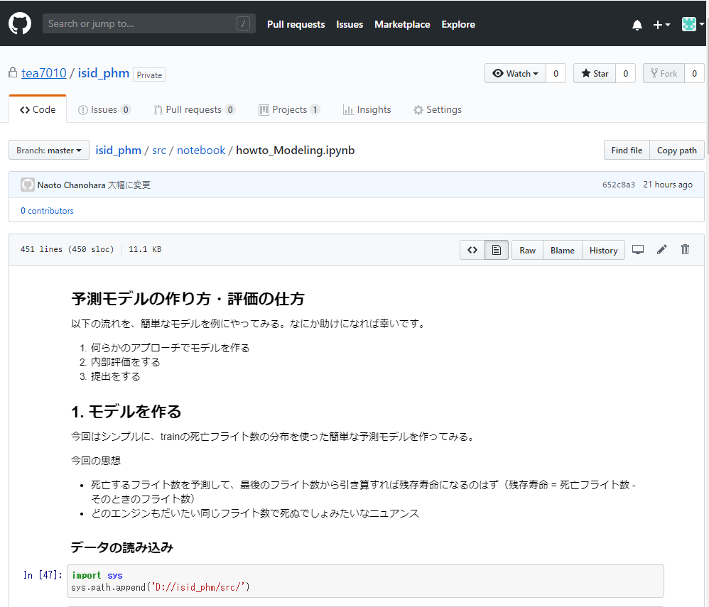

# ISIDのデータコンペ用レポジトリ・管理 

優勝目指せ！が第一目標かもしれませんが、BID全体の機械学習知識/経験の底上げが浅田さんの意図だと思ってます。
* 現段階ではデータの理解度等に差があると思うので、3人で一つのモデルを良くしていくのは、なかなか難しいです。
* そこで、個人個人でまずデータを眺める・単純でもいいので、モデリングしてみることをおすすめしたいです。
* その後、チームで同じモデルを改善していくなり、違うアプローチを分担して試していったり考えましょう。
* src下に自分の名前のフォルダ等作って、自分の実験場にしていってもいいです

## スコア変動の歴史
No|記録者|概要|内部評価|提出評価
-|-|-|-|-
1|茶之原|trainの各エンジンの最終フライト数の平均を、予測フライト数とする|32.3|31
2|茶之原|回帰アプローチ|35.16|37.27
3|茶之原|SVR|24.58|25.66080435
4|茶之原|以下、アプローチ拡大のためvalidデータを変更
5|茶之原|ベースライン|22.80919959118628|17.326520
6|茶之原|チュートリアルのモデル|34.06579|38.75855072

## フォルダ構成
```
docs: ドキュメント（整理してない）
src
 |- libs: 共通で使えそうなモジュールを置く
 |- notebook: ドキュメント的なものや実験的なノートブック（ipynb)置き場
```

## Getting started
1. notebookフォルダにhowto_EDAなど簡単なチュートリアルを用意しました。

1. github上(ブラウザ）で閲覧できるので、一回読んでみる


1. 自分でjupyter notebook/labを立ち上げて、そのファイルを実行してみる（jupyter notebook/labで開く）

1. 自分で簡単な予測モデルを作ってみたりしてみる


## 関連URL
サイト|URL
-|-
メインページ|https://industrial-big-data.io/phmc2019-datachallenge/
データDLページ|https://industrial-big-data.io/phmc2019-datachallenge_dl/
元ネタ？の論文|https://scholarcommons.usf.edu/cgi/viewcontent.cgi?article=7252&context=etd
関連論文|https://ti.arc.nasa.gov/tech/dash/groups/pcoe/prognostic-data-repository/publications/#turbofan
RULの論文|https://www.researchgate.net/publication/271921403_Remaining_useful_life_prediction_using_prognostic_methodology_based_on_logical_analysis_of_data_and_Kaplan-Meier_estimation
有名そうな論文|http://or.nsfc.gov.cn/bitstream/00001903-5/93202/1/1000004637516.pdf

